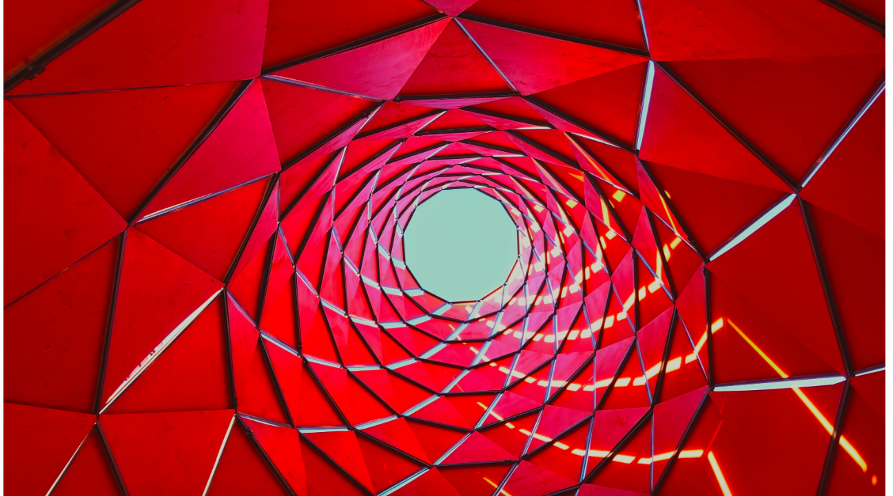

 
 

 <h1 align='center'>The Blog</h1> 
  
  

  The Blog was created with the purpose of being a personal space where I can
  post about my travels, product reviews, and more. In the past, I've used blogging
  platforms such as Tumblr which was easy to use, but I always felt constricted 
  design-wise as I was forced to use the platform's front-end templates.
  

  With this need in mind, I researched methods of combining blog posts hosted on an 
  external server with a front-end designed by me. I learned about Headless Content Management
  Systems, a back-end only content management system (CMS) that makes content accessible through RESTful API endpoints.

  The Blog fetches posts from the headless CMS Contentful and displays it using React. 
  The single page app is fully routed using React Router with state managed using Redux.

